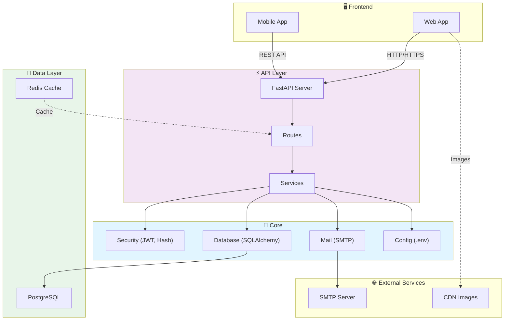
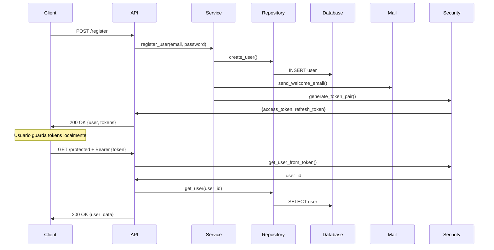

# Arquitectura - AlecTours

Descripción de la arquitectura, patrones y componentes del sistema.

---

## 🏗️ Arquitectura General



---

## 📦 Estructura de Carpetas

```
backend/app/
├── core/                    # Módulos centralizados
│   ├── config.py           # Variables de entorno
│   ├── database.py         # SQLAlchemy
│   ├── security.py         # JWT + Hashing
│   ├── mail.py             # Email
│   └── examples.py         # Ejemplos
│
├── models/                  # Modelos SQLAlchemy ORM
│   ├── user.py
│   ├── hotel.py
│   ├── reservation.py
│   └── __init__.py
│
├── schemas/                 # Esquemas Pydantic (Request/Response)
│   ├── user.py
│   ├── hotel.py
│   ├── reservation.py
│   └── __init__.py
│
├── routes/                  # Endpoints FastAPI
│   ├── auth.py
│   ├── hotels.py
│   ├── reservations.py
│   └── __init__.py
│
├── services/                # Lógica de negocio
│   ├── user_service.py
│   ├── hotel_service.py
│   ├── reservation_service.py
│   └── __init__.py
│
├── repositories/            # Acceso a datos (queries)
│   ├── user_repository.py
│   ├── hotel_repository.py
│   ├── reservation_repository.py
│   └── __init__.py
│
└── main.py                 # Punto de entrada FastAPI
```

---

## 🔄 Patrones de Diseño

### 1. Dependency Injection (FastAPI Depends)

```python
# database.py
def get_db():
    db = SessionLocal()
    try:
        yield db
    finally:
        db.close()

# routes.py
@router.get("/users")
async def list_users(db: Session = Depends(get_db)):
    # FastAPI inyecta la sesión automáticamente
    users = db.query(User).all()
    return users
```

### 2. Middleware (CORS, Logging, Error Handling)

```python
# main.py
app.add_middleware(
    CORSMiddleware,
    allow_origins=["*"],
    allow_credentials=True,
    allow_methods=["*"],
    allow_headers=["*"],
)

@app.middleware("http")
async def log_requests(request: Request, call_next):
    logger.info(f"{request.method} {request.url.path}")
    response = await call_next(request)
    return response
```

### 3. Repository Pattern (Acceso a Datos)

```python
# repositories/user_repository.py
class UserRepository:
    def __init__(self, db: Session):
        self.db = db
    
    def get_by_email(self, email: str):
        return self.db.query(User).filter(User.email == email).first()
    
    def create(self, user_data: dict):
        user = User(**user_data)
        self.db.add(user)
        self.db.commit()
        self.db.refresh(user)
        return user

# routes/auth.py
@router.post("/register")
async def register(data: UserCreate, db: Session = Depends(get_db)):
    repo = UserRepository(db)
    user = repo.create(data.dict())
    return user
```

### 4. Service Layer (Lógica de Negocio)

```python
# services/user_service.py
class UserService:
    def __init__(self, db: Session):
        self.repo = UserRepository(db)
        self.db = db
    
    async def register_user(self, email: str, password: str, nombre: str):
        # Verificar si existe
        if self.repo.get_by_email(email):
            raise ValueError("Email already exists")
        
        # Crear usuario
        user = self.repo.create({
            "email": email,
            "password": hash_password(password),
            "nombre": nombre
        })
        
        # Enviar email
        await send_welcome_email(email, nombre)
        
        # Generar tokens
        tokens = generate_token_pair(user.id)
        
        return {"user": user, **tokens}

# routes/auth.py
@router.post("/register")
async def register(data: UserCreate, db: Session = Depends(get_db)):
    service = UserService(db)
    return await service.register_user(
        data.email,
        data.password,
        data.nombre
    )
```

### 5. Schema Validation (Pydantic)

```python
# schemas/user.py
class UserCreate(BaseModel):
    email: EmailStr  # Validación automática
    nombre: str
    contraseña: str
    
    class Config:
        example = {
            "email": "juan@example.com",
            "nombre": "Juan",
            "contraseña": "password123"
        }

class UserResponse(BaseModel):
    id: int
    email: str
    nombre: str
    
    class Config:
        from_attributes = True  # Lee atributos de ORM

# routes/auth.py
@router.post("/register", response_model=dict)
async def register(user_data: UserCreate):  # Validación automática
    # Si los datos no son válidos, FastAPI retorna 422
    return user_data
```

---

## 🔐 Flujo de Autenticación



---

## 📊 Flujo de Datos en una Solicitud

```
REQUEST
   ↓
FastAPI Middleware (CORS, Logging)
   ↓
Route Handler (@router.get, @router.post)
   ↓
Dependency Injection (get_db, get_current_user)
   ↓
Schema Validation (Pydantic)
   ↓
Service Layer (Lógica de negocio)
   ↓
Repository Layer (Consultas BD)
   ↓
SQLAlchemy ORM (Database)
   ↓
PostgreSQL
   ↓
[Respuesta sube por el mismo camino]
   ↓
Response Model Validation
   ↓
JSON Response
   ↓
Client
```

---

## 🔌 Componentes Principales

### Core Modules

| Módulo | Responsabilidad | Funciones Clave |
|--------|-----------------|-----------------|
| `config.py` | Variables de entorno | Settings, DATABASE_URL |
| `database.py` | Conexión a BD | engine, SessionLocal, get_db() |
| `security.py` | Autenticación | hash_password, generate_token_pair |
| `mail.py` | Emails | send_welcome_email, send_reservation_confirmation |

### Request/Response Flow

```
Client Request
    ↓
FastAPI Route
    ↓
Pydantic Schema (Validation)
    ↓
Service Logic
    ↓
Repository Queries
    ↓
SQLAlchemy Models (ORM)
    ↓
PostgreSQL Database
    ↓
Pydantic Response Schema
    ↓
JSON Response to Client
```

---

## 🔄 Ciclo de Vida de una Solicitud

### 1. Solicitud Llega

```python
# Cliente envía
curl -X POST http://localhost:8000/auth/register \
  -H "Content-Type: application/json" \
  -d '{"email":"juan@example.com","nombre":"Juan","contraseña":"pass"}'
```

### 2. FastAPI Valida

```python
# FastAPI valida usando UserCreate schema
@router.post("/auth/register", response_model=dict)
async def register(user_data: UserCreate):
    # Si datos inválidos → Error 422
    # Si válidos → continuar
```

### 3. Service Ejecuta Lógica

```python
# Service layer
service = UserService(db)
result = await service.register_user(...)

# Dentro del service:
# 1. Verificar si usuario existe
# 2. Hashear contraseña
# 3. Guardar en BD
# 4. Enviar email
# 5. Generar tokens
```

### 4. Respuesta se Envía

```python
# Response schema valida la respuesta
return {
    "user": {
        "id": 1,
        "email": "juan@example.com",
        "nombre": "Juan"
    },
    "access_token": "eyJ...",
    "refresh_token": "eyJ...",
    "token_type": "bearer"
}
```

### 5. Cliente Recibe

```json
{
  "user": {
    "id": 1,
    "email": "juan@example.com",
    "nombre": "Juan"
  },
  "access_token": "eyJhbGciOiJIUzI1NiIsInR5cCI6IkpXVCJ9...",
  "refresh_token": "eyJhbGciOiJIUzI1NiIsInR5cCI6IkpXVCJ9...",
  "token_type": "bearer"
}
```

---

## 🎯 Mejores Prácticas de Arquitectura

### ✅ DO

- Separar lógica (Services) de acceso a datos (Repositories)
- Usar esquemas Pydantic para validación
- Dependency Injection para inyectar dependencias
- Transacciones para operaciones múltiples
- Logging de acciones importantes
- Error handling graceful

### ❌ DON'T

- Lógica en routes (mantener limpio)
- Queries directas en routes
- Sin validación de datos
- Trusting tokens sin verificación
- Hardcodear valores
- Sin manejo de errores

---

## 🚀 Escalabilidad

### Próxima Fase: Caché

```python
from redis import Redis
redis_client = Redis(host='localhost', port=6379)

@router.get("/hotels/{hotel_id}")
async def get_hotel(hotel_id: int):
    # Intentar obtener del cache
    cached = redis_client.get(f"hotel:{hotel_id}")
    if cached:
        return json.loads(cached)
    
    # Si no está en cache, obtener de BD
    hotel = db.query(Hotel).filter(Hotel.id == hotel_id).first()
    
    # Guardar en cache por 1 hora
    redis_client.setex(f"hotel:{hotel_id}", 3600, json.dumps(hotel))
    
    return hotel
```

### Próxima Fase: Queue de Emails

```python
from celery import Celery

celery_app = Celery('alectours', broker='redis://localhost:6379')

@celery_app.task
def send_email_async(email: str, subject: str, body: str):
    await send_email(email, subject, body)

# En ruta
@router.post("/register")
async def register(...):
    # Enviar email en background
    send_email_async.delay(email, "Bienvenido", "...")
    return user
```

---

**Ver también:** [INDEX.md](INDEX.md) | [QUICKSTART.md](QUICKSTART.md) | [CORE_README.md](CORE_README.md)
